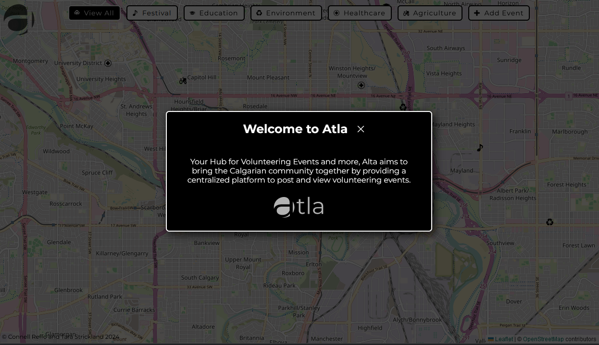
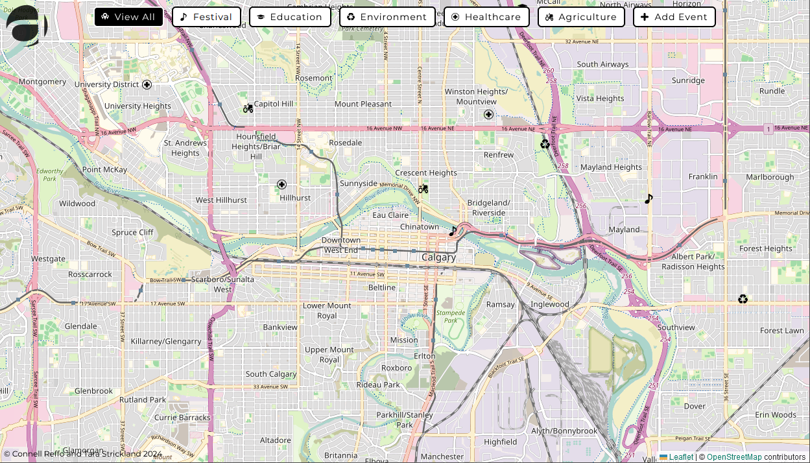
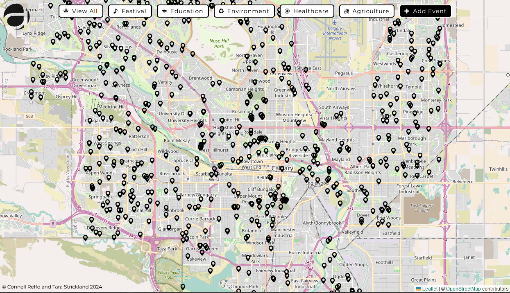
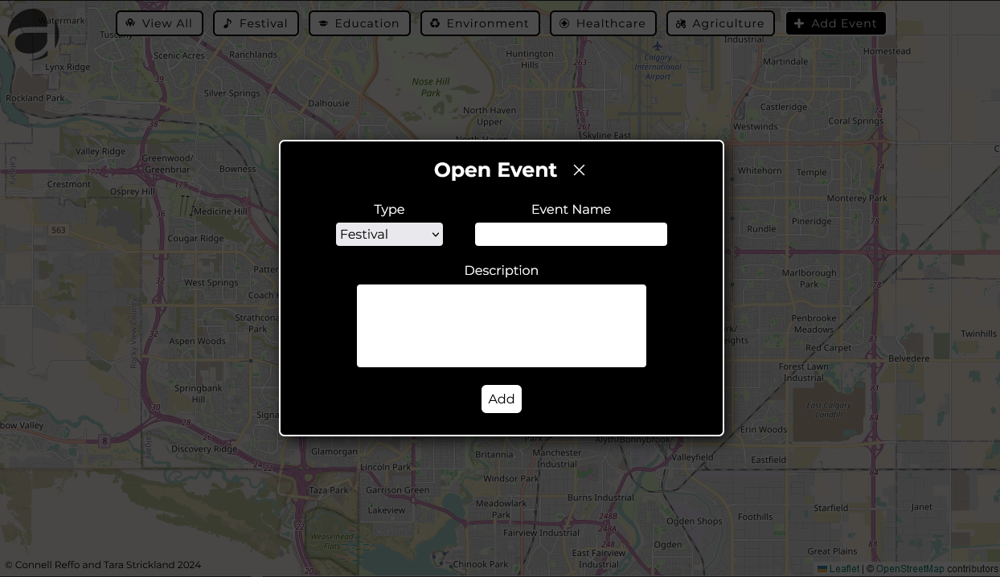
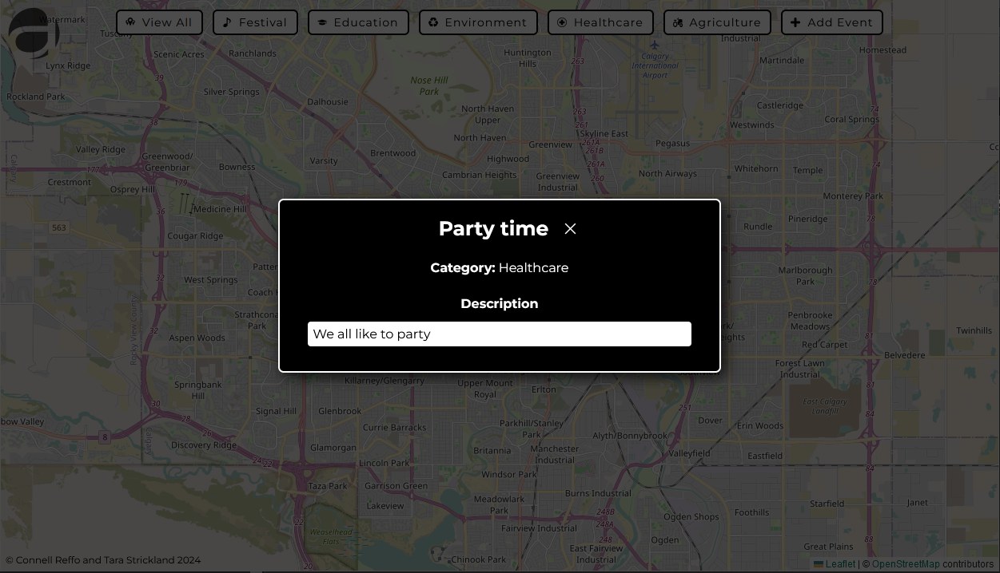

<h1 align="center">
    
</h1>

> Project for Calgary Hacks 2024!


<br />

## Overview

Your Hub for Volunteering Events and more, Alta aims to bring the Calgarian community together by providing a centralized platform to post and view volunteering events.

<br />

## Chosen Prompt

$$
\text{``Use the City of Calgary's Open Data Portal to develop a tool
or application that supports and improves the lives of Calgarians."}
$$

<br />

## Development

First, run the development server:

```bash
npm run dev
# or
yarn dev
# or
pnpm dev
# or
bun dev
```

Open [http://localhost:3000](http://localhost:3000) with your browser to see the result.

## Screenshots







<br />
<br />

<div align="center">
    
    <div>Developed by <b>Connell Reffo</b> and <b>Tara Strickland</b> for <b>Calgary Hacks 2024</b></div>
</div>
